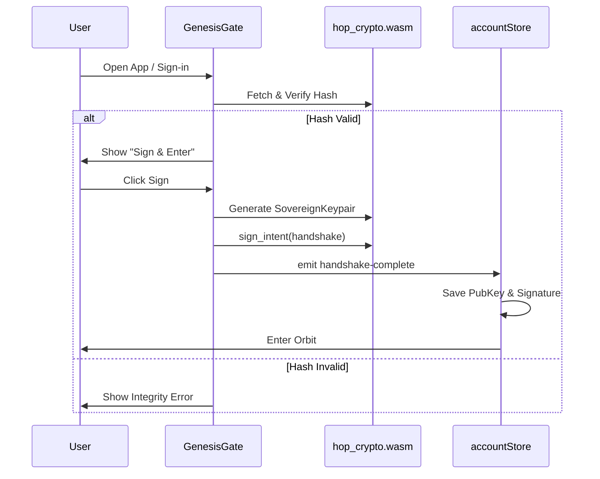

# Genesis Handshake & Sovereign Identity Plan

This plan outlines the implementation of the `genesisGate.vue` component and its integration into the BentoBoxDS setup flow.

## Architecture Overview

The Genesis Handshake is the first step in establishing a peer's identity on the Health Oracle Protocol (HOP). It involves:
1. **Integrity Verification**: Ensuring the cryptographic WASM module (`hop_crypto.wasm`) matches the expected genesis hash.
2. **Key Generation**: Creating a `SovereignKeypair` using the verified WASM module.
3. **Initial Signing**: Signing a "Handshake" intent to create the first entry in the peer's Coherence Ledger.

## Implementation Steps

### 1. Create `genesisGate.vue`
- Location: `src/components/toolbars/account/genesisGate.vue`
- Responsibilities:
    - Fetch `/pkg/hop_crypto_bg.wasm`.
    - Perform SHA-256 integrity check.
    - Initialize WASM via `init()`.
    - Provide UI for the "Genesis Handshake".
    - Emit `handshake-complete` with public key and signature.

### 2. Integrate into `selfAuth.vue`
- Modify `src/components/toolbars/account/selfAuth.vue`.
- Add a new state to track if the handshake is required (e.g., `needsHandshake`).
- Replace the "Connect to HOP" button or wrap it with the `GenesisGate` component when a new identity is being created.

### 3. Update `accountStore.js`
- Add state for `sovereignId` (public key) and `genesisSignature`.
- Add an action `completeHandshake(data)` to persist these values and transition the app state to "authenticated".

## Verification Plan
- **Integrity Check**: Manually alter the `GENESIS_WASM_HASH` to ensure the error state triggers.
- **Key Generation**: Log the `Sovereign ID` and `Genesis Signature` to the console to verify WASM execution.
- **Flow**: Ensure that after clicking "Sign & Enter", the user is correctly transitioned into the main app experience.
