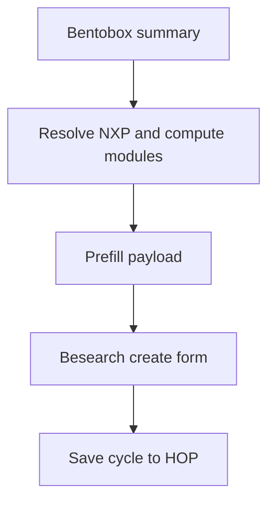

# Average peer case plan: besearch form autofill from bentobox + computation selection

## Goal
Enable a besearch cycle to be created from an existing bentobox, with dependable autofill and a computation picker that is conditional on the selected network experiment.

## Current touchpoints
- Besearch form supports `initialData` merge via props in [`src/components/besearch/lifetools/besearchCreateForm.vue`](src/components/besearch/lifetools/besearchCreateForm.vue:1)
- Bentobox toolbar builds a prefill payload in [`src/components/bentobox/tools/boxTools.vue`](src/components/bentobox/tools/boxTools.vue:1)
- Library utility can resolve NXP and compute modules from a bentobox summary in [`src/stores/hopUtility/libraryUtility.js`](src/stores/hopUtility/libraryUtility.js:1)
- Besearch store handles saving in [`src/stores/besearchStore.js`](src/stores/besearchStore.js:1)

## Decisions to codify
1. **Name autofill**
   - Default to blank **unless** a clear NXP name exists.
   - If NXP exists: prefill with `Average daily <signal>` template when the compute selection is daily average and a marker or signal can be inferred.
   - Otherwise use `NXP name + cycle` as a suggested value (not forced).
   - Rationale: avoids misleading names like Movement cycle when multiple cycles exist per cue space.

2. **Marker default**
   - Add explicit `None` option in marker dropdown.
   - When `None` is selected, allow form submission and store `markerIds: []`.
   - This keeps NXP-focused cycles valid when no marker is attached yet.

3. **Computation options conditional on NXP**
   - Compute options should be derived from the selected NXP contract summary, not the global compute library.
   - Use the summary already built for the bentobox (via `boxLibSummary`) and the resolver in [`src/stores/hopUtility/libraryUtility.js`](src/stores/hopUtility/libraryUtility.js:1).
   - Fallback: if no NXP summary is available, show an empty list with a prompt to open the library.

4. **Frequency window behavior**
   - Keep frequency selection, but add optional window configuration for `daily` such as `00:00–23:59` default, with overrides for sleep windows `21:00–08:59`.
   - Store window in a new field on the besearch cycle payload so HOP can schedule the compute.

## Data flow for autofill

## Required UI adjustments
- Add compute selector below the network experiment selector in [`src/components/besearch/lifetools/besearchCreateForm.vue`](src/components/besearch/lifetools/besearchCreateForm.vue:1).
- Populate compute selector based on selected NXP and prefill from bentobox when available.
- Add a `None` marker option and make marker optional in validation when `None` is selected.
- Add optional time window fields when frequency is `daily`.

## Implementation steps
1. **Normalize prefill payload from bentobox**
   - Ensure [`src/components/bentobox/tools/boxTools.vue`](src/components/bentobox/tools/boxTools.vue:1) only sets name if NXP name exists.
   - Include `computeOptions` derived from NXP summary via [`src/stores/hopUtility/libraryUtility.js`](src/stores/hopUtility/libraryUtility.js:1).
   - Include `timeWindow` defaults when frequency is daily.

2. **Besearch form: optional marker + compute selector**
   - Add `None` option in marker dropdown and relax validation when marker is None.
   - Add compute dropdown that is populated by `computeOptions` or derived from selected NXP.
   - Persist selected compute into the payload with `computeContractId` or `computeContract`.

3. **NXP-specific compute derivation**
   - On NXP change, recompute compute options using the NXP contract summary if available.
   - If no summary, show empty list with helper text guiding user to the library.

4. **Persist scheduling window**
   - Add `timeWindow` to the cycle payload for daily cycles and document expected HOP behavior.

5. **Save cycle payload**
   - Update [`src/stores/besearchStore.js`](src/stores/besearchStore.js:1) save action to accept the added fields.

## 6. Model Evolution & Learning (The Emulation Layer)
The HOP system uses a 'Low-Res to High-Fidelity' growth strategy.

### A. Evolutionary Seed
- Every peer starts with a 'Base Model' (e.g., a generic 4-chamber heart or a linear river path).
- The Heli Clock tracks the **Fidelity Score**: the resonance between the Base Model's predictions and real-world sensor feedback.

### B. Machine Learning Emulation (Physics-Informed)
- Avoid 'Black Box' AI. Use Physics-Informed ML that respects the Orbital Vector.
- Data points logged at specific θ_solar/θ_earth coordinates are used to 'carve' the model. 
  - *Example:* HRV peaks at θ_solar=180° adjust the simulated heart's electrical conductivity parameters.
  - *Example:* Rainfall at θ_earth=270° adjusts the river model's meander-velocity coefficients.

### C. Feedback Loops
- **Validation:** Use 'Ghost Anchors' to compare the Emulated Model's projected state against real-world captures (Satellite, PPG, Ledger Proofs).
- **Growth:** The model 'evolves' its geometry (shape of the heart valves, curvature of the riverbed) over multiple Earth Cycles.